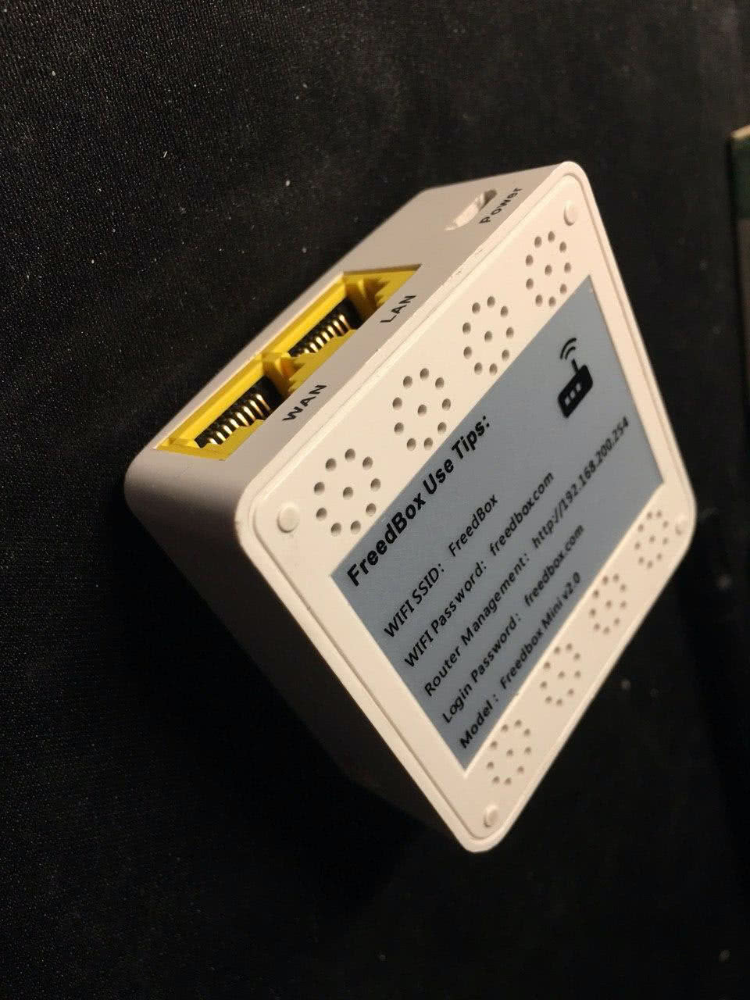
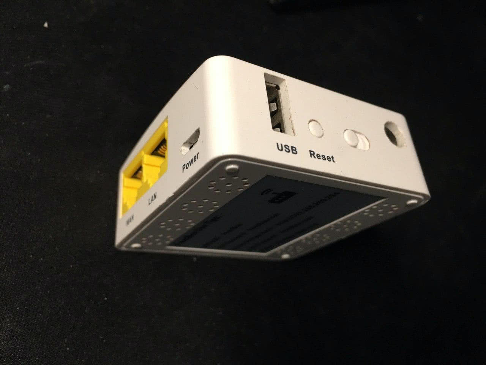

# Freedbox Mini v2.0

It is an OEM version of [GL.iNet AR150](https://openwrt.org/toh/gl.inet/gl-ar150) which comes with a heavily modified U-Boot and customized OpenWRT.

## Hardware

The onboard SPI Flash is a [Winbond 25Q128FVSG](https://www.winbond.com/resource-files/w25q128fv_revhh1_100913_website1.pdf). The chip must be soldered off board to re-flash. (If you don't have any heatgun at hand, you can use a solder to lift its GND pin to disconnect it from the power rail.)

## Software

### Factory software

The factory version of U-boot is an unknown version of [pepe2k/u-boot_mod](https://github.com/pepe2k/u-boot_mod) with signature and/or offset different from the public code. Thus the U-boot can flash but cannot boot an official OpenWRT firmware.

Unluckily I destoried the factory OS so I don't have any dump in hand. It is a OpenWRT with most luci functionalities removed and have Shadowsocks program and server configuration built in. If you want to have a peek what is inside, see [Root 你的 FreedBox](https://blog.swineson.me/zh/root-your-freedbox/).

[freedbox_uboot_dump.zip](dumps/freedbox_uboot_dump.zip) is a dump of the SPI flash with the factory U-boot and a non-bootable OpenWRT.

### OpenWrt

To flash the official OpenWrt release, **do not upgrade from factory OS or U-boot**, instead:

1. dump the SPI flash content (important! If you do not backup it, you might brick the device. If your factory OS is still working, please send the dump to me)
2. replace the first 256KiB of the dump with content from [u-boot_mod**gl-inet_gl-ar150**20180223\_\_git_master-7a540a78.zip](dumps/u-boot_mod__gl-inet_gl-ar150__20180223__git_master-7a540a78.zip)
3. flash the modified dump back
4. enter recovery from the device and flash OpenWRT firmware

Note:

- U-boot file is downloaded from [projects.dymacz.pl](http://projects.dymacz.pl/?dir=u-boot_mod).
   see [pepe2k/u-boot_mod](https://github.com/pepe2k/u-boot_mod) for details.
